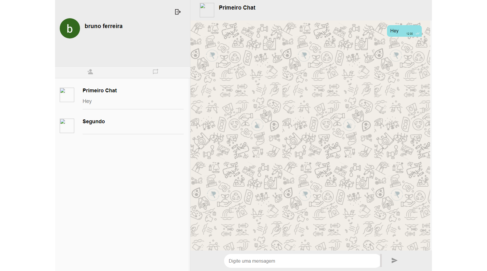

# Chat


# Technologies
Project created with:
* Next.js
* Node.js
* Socket.io 
* MySQL
* Typescript

# Description
## **What the application does?**
In this chat app is possible to add anyone by email, create new chats with added friends 
and has read receipt system.

## **Why i used these technologies?**
I choose Next.js to work with nextOAuth, Node.js was used to build the entire back-end with express,
the database, needs to be relacional, was builded with MySQL and socket.io for real-time chat.

## **Some challenges and issues**
Using the socket for the first time was a challenge, especially with the front-end, 
because it needs to run in an especific time, not just in user's chat but also in user's friend's chat.

⚠⚠⚠ The application has a performance problem in the conversationContext.tsx file, 
where the useEffect's functions runs more than the necessary

## **Future Features**
* Correct the performance problem
* Migrations
* Chat starts from the bottom
* Send messages on Enter click
* Responsiveness
* Send images and audio messages
* Online and last seen

<!-- # Installation
Use the yarn package manager to install all dependencies, in each directory run
```
  yarn install
```

# Usage 
To run this project 1 script will need to be executed in each directory, run each one in
a different terminal. In the `/chat-next` directory you need to run `yarn dev`, 
in the `/chat-node` directory you need to run `yarn server`
```
  cd chat-next
  yarn dev
```
```
  cd chat-node
  yarn server
``` -->